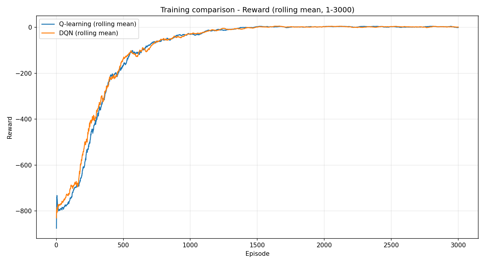
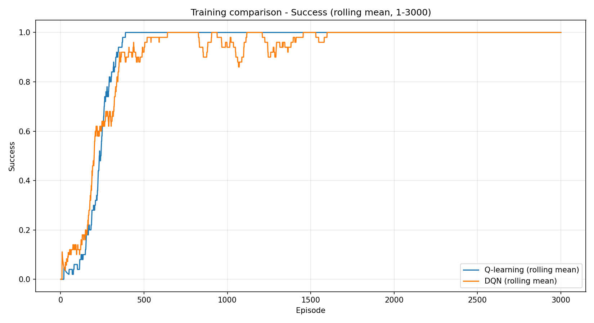

# Reinforcement Learning on Taxi-v3

**Tabular Q-learning and a neural Q-learning agent, compared on the same discrete control task.**

A university project exploring how a lookup table and a learned state representation solve passenger pickup and delivery in Gymnasium's Taxi-v3. Includes training, greedy evaluation, hyperparameter search, saved models, and learning curves.

**Stack:** Python · Gymnasium · NumPy · PyTorch · Matplotlib

## Project at a glance

- **Question:** How do tabular Q-learning and a DQN-style agent behave on a small, discrete environment?
- **Implementation:** A 500 × 6 Q-table versus a state embedding and a two-hidden-layer neural network with experience replay.
- **Evaluation:** Episode return, steps, illegal pickup/drop-off penalties, and successful deliveries.
- **Recorded result:** Both best-run tuning summaries report 100% success and an average return of 8.01 across 100 greedy evaluation episodes. These are stored model-selection results, not a multi-seed benchmark.



*Stored training comparison. Exploration remains active during training; these curves should be read separately from greedy evaluation results. See [experimental details](docs/EXPERIMENTS.md).*

## The task

The taxi must collect a passenger and deliver them to the correct destination on a 5 × 5 grid. There are 500 encoded states and six actions: south, north, east, west, pickup, and drop-off. Rewards are +20 for a successful delivery, −10 for an illegal pickup/drop-off, and −1 otherwise. Episodes are capped at 200 steps.

Both agents receive the integer state ID and select from all six actions; neither uses action masking. See the [official Taxi documentation](https://gymnasium.farama.org/environments/toy_text/taxi/) for background. That page also covers newer versions; this project intentionally uses **Taxi-v3**.

## Quick start

Use Python 3.10 or newer. Run all commands from the repository root. A GPU is optional; DQN scripts automatically use CUDA when available.

```bash
git clone https://github.com/tomgiorgini/Reinforcement-Learning-on-Taxi-v3.git
cd Reinforcement-Learning-on-Taxi-v3
python -m venv .venv
```

Activate the environment:

```bash
# macOS / Linux
source .venv/bin/activate
```

```powershell
# Windows PowerShell
.\.venv\Scripts\Activate.ps1
```

Install dependencies:

```bash
python -m pip install -r requirements.txt
```

Gymnasium is pinned to retain Taxi-v3. Other dependencies are not a historical lockfile; the original experiment environment was not recorded. PyTorch is required even for tabular scripts because shared utilities import it.

### Evaluate the included models

A Q-table and a DQN checkpoint are included, so you can start without retraining:

```bash
python tabular/test_q_learning.py
python dqn/test_dqn.py
```

Each command prints mean reward, steps, penalties, and success rate, then writes plots under `results/test_q_learning/` or `results/test_dqn/`. Defaults evaluate **1,000 episodes for Q-learning and 100 for DQN**. For a matched comparison, set `TEST_EPISODES = 1000` in the DQN evaluator; see the [evaluation protocol](docs/EXPERIMENTS.md#evaluation-protocol).

### Train your own agents

```bash
python tabular/train_q_learning.py
python dqn/train_dqn.py
```

Each agent trains for 3,000 episodes by default and saves a model, learning curves, and a rolling-mean CSV. **Rerunning scripts overwrites their corresponding tracked outputs**, including checkpoints when training.

Most hyperparameters live in [config.py](config.py). Episode counts, seeds, output paths, and evaluation settings also appear in scripts' main blocks; there is no command-line argument interface. See the [running guide](docs/RUNNING.md) for outputs, tuning, and troubleshooting.

## What is implemented?

| | Tabular Q-learning | DQN-style agent |
| --- | --- | --- |
| State representation | Direct Q-table lookup | Learned 32-dimensional embedding |
| Value function | 500 × 6 table | 32 → 128 → 128 → 6 MLP with ReLU hidden layers |
| Learning | One-step Q-learning update | Replay batches, Adam, Huber loss, gradient clipping |
| Exploration | Linear epsilon-greedy schedule | Linear epsilon-greedy schedule |
| Saved model | NumPy `.npy` table | PyTorch `.pth` state dictionary |

The neural agent uses the **same online network** for current and next-state values. It has no separate target network, so it is a simplified DQN-style implementation. See the [update rules and limitations](docs/EXPERIMENTS.md).

## Recorded results

These values come from existing **best-run tuning summaries**, reporting 1,500 training episodes and 100 greedy evaluation episodes:

| Agent | Success rate | Mean return | Mean steps | Mean penalties |
| --- | ---: | ---: | ---: | ---: |
| Q-learning | 100% | 8.01 | 12.99 | 0.00 |
| DQN-style | 100% | 8.01 | 12.99 | 0.00 |

Sources: [Q-learning tuning log](results/TUNING_Q_LEARNING.TXT), [DQN best-run summary](results/dqn_tuning/best_run.txt), and [DQN search CSV](results/dqn_tuning/tuning_results.csv).

These records show successful policies on the reported evaluation sequence. They do not establish that the methods are equivalent or that the neural agent improves on the tabular baseline. Stored best configurations differ from today's defaults, and the DQN tuning script contains [configuration mismatches](docs/EXPERIMENTS.md#limitations-and-next-steps).



## Repository structure

| Path | Contents |
| --- | --- |
| [tabular/](tabular/) | Q-learning training, greedy evaluation, and grid search |
| [dqn/](dqn/) | Embedding network, replay buffer, training, evaluation, and grid search |
| [config.py](config.py) | Environment and algorithm defaults |
| [utils.py](utils.py) | Logging, smoothing, seeding, and tuning score |
| [results/](results/) | Stored checkpoints, plots, CSVs, and tuning logs |
| [docs/RUNNING.md](docs/RUNNING.md) | Commands, outputs, configuration, and troubleshooting |
| [docs/EXPERIMENTS.md](docs/EXPERIMENTS.md) | Protocol, metrics, evidence, and limitations |

## Scope and next steps

This project demonstrates value-based RL, experience replay, experiment logging, hyperparameter search, and evaluation of learned policies. Taxi's small state space makes a tabular baseline practical and provides a useful setting for studying the additional complexity of function approximation.

Next steps are to align evaluation budgets, fix inactive DQN tuning fields, standardize terminal-state handling and seeding, and report results across multiple training seeds. A target-network variant would provide a useful extension to the neural baseline. See the [detailed limitations](docs/EXPERIMENTS.md#limitations-and-next-steps).
